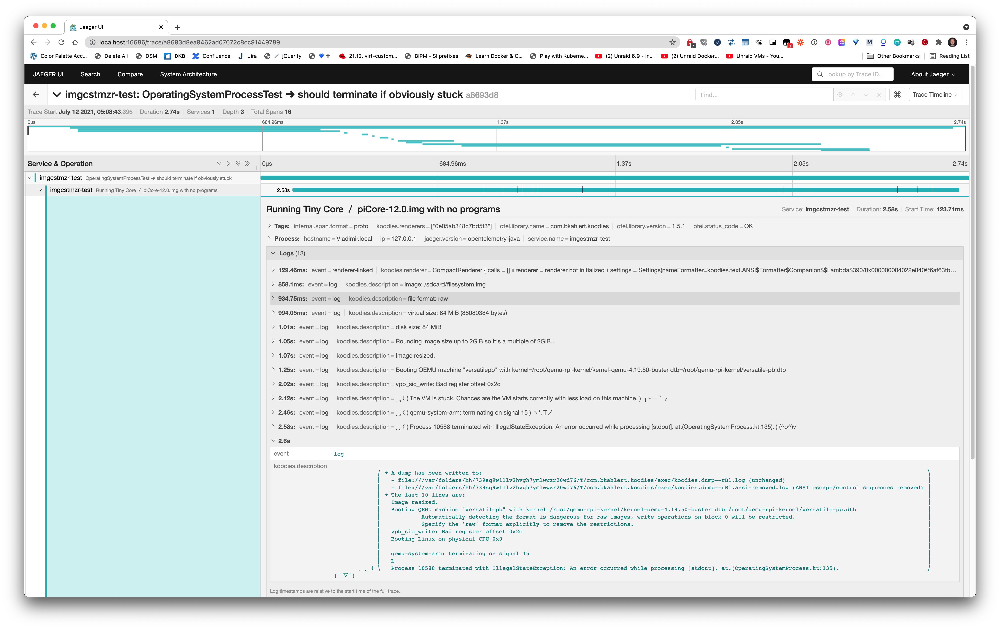
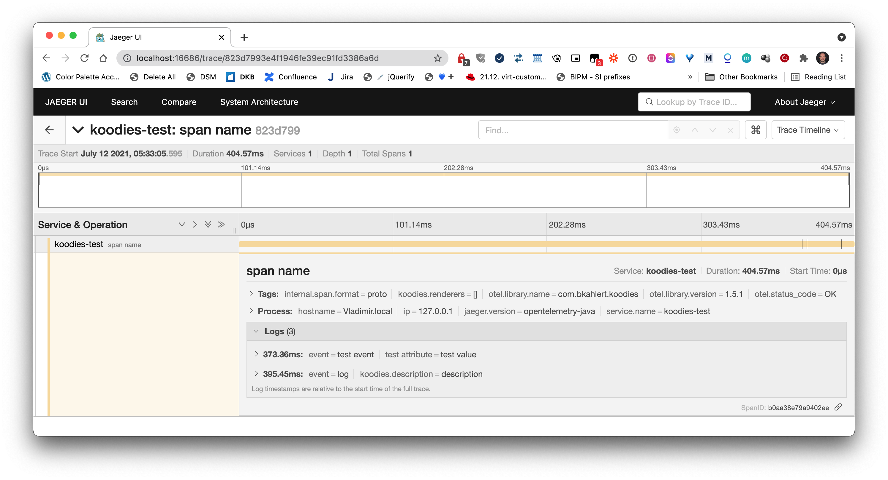

# Changelog

## [Unreleased]

### Added

- DelegatedCharSequence
- CharSequence.concatToString()
- Either

### Changed

- updated to Kotlin 1.7.0

### Deprecated

*none*

### Removed

- ArrayBuilder
- ListBuilder
- SetBuilder
- EnumSetBuilder
- MapBuilder

### Fixed

*none*

## [1.6.1] - 2021-12-19

### Added

*none*

### Changed

*none*

### Deprecated

*none*

### Removed

*none*

### Fixed

*none*

## [1.6.0] - 2021-07-26

### Added

The observability library [OpenTelemetry](https://opentelemetry.io/) is natively supported. Simply start a process and watch for yourself:

[](docs/tracing-dockerpi.png)

For manual instrumentation, the `spanning` function is provided:

```kotlin
spanning("span name") {
    event("test event", Key.stringKey("test attribute") to "test value")
    log("description") // = event("log", RenderingAttributes.DESCRIPTION to description)
    42 // = return value
}
```

[](docs/tracing-simplespan.png)

By default, the span and all events with a description are also printed to the console:

```text
╭──╴span name
│
│   description                                                                 
│
╰──╴✔︎
```

## [1.5.0] - 2021-05-12

### Added

#### Exec: Feature-Rich Process Execution

##### ⌨️ *Execute* Command Lines *on* Host

```kotlin
CommandLine("printenv", "HOME")
    .exec() // .exec.logging() // .exec.processing { io -> … } 
```

##### 📄 *Execute* Shell Scripts *on* Host

```kotlin
ShellScript { "printenv | grep HOME | perl -pe 's/.*?HOME=//'" }
    .exec() // .exec.logging() // .exec.processing { io -> … }
```

##### 🐳 *Execute* Command Lines *in* Docker Container

```kotlin
CommandLine("printenv", "HOME").dockerized { "ubuntu" }
    .dockerized { "ubuntu" }
    .exec() // .exec.logging() // .exec.processing { io -> … }
```

*or even simpler*

```kotlin
with(tempDir()) { // working directory provided via receiver
    ubuntu("printenv", "HOME") // busybox
        .exec() // .exec.logging() // .exec.processing { io -> … }
}
```

##### 🐳 *Execute* Shell Scripts *in* Docker Container

```kotlin
ShellScript { "printenv | grep HOME | perl -pe 's/.*?HOME=//'" }
    .dockerized { "ubuntu" }
    .exec() // .exec.logging() // .exec.processing { io -> … }
```

*or even simpler*

```kotlin
with(tempDir()) { // working directory provided via receiver
    ubuntu { "printenv | grep HOME | perl -pe 's/.*?HOME=//'" } // busybox
        .exec() // .exec.logging() // .exec.processing { io -> … }
}
```

##### How can you run?

###### Degree of Interaction

**▶️ executing-only**

```kotlin
CommandLine("…") // ShellScript { … }
    .exec()
```

**📝 logging**

```kotlin
CommandLine("…") // ShellScript { … }
    .exec.logging()
```

- If things go wrong, it's also logged:
  ```text
  Process {PID} terminated with exit code {…}
  ➜ A dump has been written to:
  - {TempDir}/kommons/exec/dump.*.log
  - {TempDir}/kommons/exec/dump.*.ansi-removed.log
    ➜ The last 10 lines are:
    {…}
    3
    2
    1
    Boom!
  ```  

**🧠 processing**

```kotlin
CommandLine("…") // ShellScript { … }
    .exec.processing { io -> doSomething(io) }`
```

- `io` is typed; simply use `io is IO.Output` to filter out errors and meta information

###### Synchronicity

**👯‍♀️ 👯‍♂️ synchronous**

```kotlin
CommandLine("…") // ShellScript { … }
    .exec() // .exec.logging() // .exec.processing { io -> … }
```

**💃 🕺 asynchronous**

```kotlin
CommandLine("…") // ShellScript { … }
    .exec.async() // .exec.async.logging() // .exec.async.processing { io -> … }
```

#### Automatically Captured I/O

Whatever variant you choose, life-cycle events, sent input, the process's output and errors are stored for you:

```kotlin
CommandLine(…).exec().io
CommandLine(…).exec().io.output
CommandLine(…).exec().io.error.ansiRemoved
```

#### Typed (Exit) State

- Access the state with `state`, which is either an instance of `Running`, `Exited`
  (with the sub states `Succeeded` and `Failed`) or `Excepted`.
- All states print nicely and provide a copy of all logged I/O, and state-dependent information such as the exit code.
- By default, processes are killed on VM shutdown, which can be configured.
- Life-cycle callbacks can be registered.

#### Ready to run Docker commands

```kotlin
with(tempDir()) {
    SvgFile.copyTo(resolve("kommons.svg"))

    // convert SVG to PNG using command line-style docker command
    docker("minidocks/librsvg", "-z", 5, "--output", "kommons.png", "kommons.svg")

    // convert PNG to ASCII art using shell script-style docker command
    docker("rafib/awesome-cli-binaries", logger = null) {
        """
           /opt/bin/chafa -c none --fill all  -w 9 kommons.png
        """
    }.io.output.ansiKept.resetLines().let { println(it) }
}
```

##### Output

<!-- @formatter:off -->
```text
&&&&&&&&&&&&&&&&&&&&&&&▲┺u╲╲╲╲╲╲╲╲╲╲╲╲╲╲╲╲╲╲╲╲╲╲┶ 
&&&&&&&&&&&&&&&&&&&&&▲┺u╲╲╲╲╲╲╲╲╲╲╲╲╲╲╲╲╲╲╲╲╲╲┶   
&&&&&&&&&&&&&&&&&&&▲┺u╲╲╲╲╲╲╲╲╲╲╲╲╲╲╲╲╲╲╲╲╲╲┶     
&&&&&&&&&&&&&&&&&▲┺u╲╲╲╲╲╲╲╲╲╲╲╲╲╲╲╲╲╲╲╲╲╲┶       
&&&&&&&&&&&&&&&▲┺u╲╲╲╲╲╲╲╲╲╲╲╲╲╲╲╲╲╲╲╲╲╲┶         
&&&&&&&&&&&&&▲┺u╲╲╲╲╲╲╲╲╲╲╲╲╲╲╲╲╲╲╲╲╲╲┶           
&&&&&&&&&&&▲┺u╲╲╲╲╲╲╲╲╲╲╲╲╲╲╲╲╲╲╲╲╲╲┶             
&&&&&&&&&▲┺u╲╲╲╲╲╲╲╲╲╲╲╲╲╲╲╲╲╲╲╲╲╲┶               
&&&&&&&▲┺u╲╲╲╲╲╲╲╲╲╲╲╲╲╲╲╲╲╲╲╲╲╲┶                 
&&&&&▲┺u╲╲╲╲╲╲╲╲╲╲╲╲╲╲╲╲╲╲╲╲╲╲┶                   
&&&▲┺u╲╲╲╲╲╲╲╲╲╲╲╲╲╲╲╲╲╲╲╲╲╲┶                     
&▲┺u╲╲╲╲╲╲╲╲╲╲╲╲╲╲╲╲╲╲╲╲╲╲┶                       
┺╲╲╲╲╲╲╲╲╲╲╲╲╲╲╲╲╲╲╲╲╲╲╲┺┘                        
╲╲╲╲╲╲╲╲╲╲╲╲╲╲╲╲╲╲╲╲╲╲z╲╊╊}╷                      
╲╲╲╲╲╲╲╲╲╲╲╲╲╲╲╲╲╲╲╲z╲╊╊╊╊╊╊}╷                    
╲╲╲╲╲╲╲╲╲╲╲╲╲╲╲╲╲╲z╲╊╊╊╊╊╊╊╊╊╊}╷                  
╲╲╲╲╲╲╲╲╲╲╲╲╲╲╲╲z╲╊╊╊╊╊╊╊╊╊╊╊╊╊╊}╷                
╲╲╲╲╲╲╲╲╲╲╲╲╲╲z╲╊╊╊╊╊╊╊╊╊╊╊╊╊╊╊╊╊╊}╷              
╲╲╲╲╲╲╲╲╲╲╲╲z╲╊╊╊╊╊╊╊╊╊╊╊╊╊╊╊╊╊╊╊╊╊╊}╷            
╲╲╲╲╲╲╲╲╲╲z╲╊╊╊╊╊╊╊╊╊╊╊╊╊╊╊╊╊╊╊╊╊╊╊╊╊╊}╷          
╲╲╲╲╲╲╲╲z╲╊╊╊╊╊╊╊╊╊╊╊╊╊╊╊╊╊╊╊╊╊╊╊╊╊╊╊╊╊╊}╷        
╲╲╲╲╲╲z╲╊╊╊╊╊╊╊╊╊╊╊╊╊╊╊╊╊╊╊╊╊╊╊╊╊╊╊╊╊╊╊╊╊╊}╷      
╲╲╲╲z╲╊╊╊╊╊╊╊╊╊╊╊╊╊╊╊╊╊╊╊╊╊╊╊╊╊╊╊╊╊╊╊╊╊╊╊╊╊╊}╷    
u╲z╲╊╊╊╊╊╊╊╊╊╊╊╊╊╊╊╊╊╊╊╊╊╊╊╊╊╊╊╊╊╊╊╊╊╊╊╊╊╊╊╊╊╊}╷  
┺╲╊╊╊╊╊╊╊╊╊╊╊╊╊╊╊╊╊╊╊╊╊╊╊╊╊╊╊╊╊╊╊╊╊╊╊╊╊╊╊╊╊╊╊╊╊╊┾⣠
```
<!-- @formatter:on -->

- All docker commands (`docker`, `ubuntu`, `busybox`, `curl`, `download`, `nginx`, …) use the path in the receiver to
    - set the working directory of both the host command and the docker container
    - map the host working directory to the container's working directory,
    - that is, all files of that directory are equally available in your container instance.
- Low-level docker commands: `start`, `run`, `stop`, `kill`, `remove`, `search`, `image`, `ps`
- Object-oriented design
    - [Docker](src/jvmMain/kotlin/com/bkahlert/kommons/docker/Docker.kt): `engineRunning`, `info`, `images`, `containers`, `search`, `exec`
    - [DockerImage](src/jvmMain/kotlin/com/bkahlert/kommons/docker/DockerImage.kt): `list`, `isPulled`, `pull`, `tagsOnDockerHub`
    - [DockerContainer](src/jvmMain/kotlin/com/bkahlert/kommons/docker/DockerContainer.kt): `start`, `stop`, `state`, `kill`, `remove`
- See [ExecutionIntegrationTest.kt](src/jvmTest/kotlin/com/bkahlert/kommons/ExecutionIntegrationTest.kt) and
  [Docker.kt](src/jvmMain/kotlin/com/bkahlert/kommons/docker/Docker.kt) for more examples.

#### Multi-Platform Builders

##### Array Builder

```kotlin
val array = buildArray {
    add("test")
    add("𓌈🥸𓂈")
}
```

##### List Builder

```kotlin
val array = buildList {
    add("test")
    add("𓌈🥸𓂈")
}
```

##### Set Builder

```kotlin
val array = buildSet {
    add("test")
    add("𓌈🥸𓂈")
}
```

##### Map Builder

```kotlin
val array = buildMap {
    "ten" to 3
    "𓌈🥸𓂈".let { it to it.length }
}
```

#### IP Address Tooling (4 & 6)

```kotlin
val ip4 = ipOf<IPv4Address>("192.168.16.25")
val ip6 = ip4.toIPv6Address()
val range = ip6.."::ffff:c0a8:1028".toIp() // ::ffff:c0a8:1019..::ffff:c0a8:1028
val subnet = ip6 / 122 // ::ffff:c0a8:1000/122
check(range.smallestCommonSubnet == subnet) // ✔︎
check(subnet.broadcastAddress.toInetAddress().isSiteLocalAddress) // ✔︎
```

#### Improved Java NIO 2 Integration

##### Access the Class Path

```kotlin
classPath("file.svg").copyTo(somewhere)
```

##### Copy and Delete Recursively

```kotlin
directory.copyRecursivelyTo(somewhere)
```

```kotlin
directory.deleteRecursively()
```

##### Fluent API

```kotlin
if (path.notExists()) path.createParentDirectories().createFile()
```

#### Units

##### Decimal and Binary Bytes

```kotlin
10.Yobi.bytes > 10.Yotta.bytes
```

##### Arithmetics

```kotlin
3.Tera.bytes + 200.Giga.bytes == 3.2.Tera.bytes
2 * 3.Kibi.bytes == 6.Kibi.bytes
```

##### File and Directory Size

```kotlin
Paths.get("/tmp").getSize() // 1.9 TB
listOf(largeFile, smallFile, mediumFile).sortedBy { it.getSize() }
```

##### From and to String

```kotlin
1.25.Mega.bytes.toString() == "1.25 MB"
"1.25 MB".toSize() == 1.25.Mega.bytes
4_200_000.Yobi.bytes.toString(BinaryPrefix.Mebi, 4) == "4.84e+24 MiB"
```

##### Useless Nerd Stuff

```kotlin
42.hecto.bytes
42.mebi.days
```

#### Unicode

##### Code Points and Grapheme Clusters

```kotlin
// Process each actual character (and not each `char`)
"aⒷ☷\uD83D\uDC69\u200D\uD83D\uDC69\u200D\uD83D\uDC67\u200D\uD83D\uDC67".asCodePointSequence {
    println(it) // "a", "Ⓑ", "☷", ":woman:" ZWJ, ":woman:", ZWJ, ":girl:", ZWJ, ":girl:"
}
```

##### [LineSeparators](src/commonMain/kotlin/com/bkahlert/kommons/text/LineSeparators.kt)

```kotlin
LineSeparators.toList() == listOf(
    LineSeparators.CRLF, // carriage return + line feed (\\r\\n)
    LineSeparators.LF,   // line feed (\\n)
    LineSeparators.CR,   // carriage return (\\r)
    LineSeparators.NL,   // next line 
    LineSeparators.PS,   // paragraph separator 
    LineSeparators.LS,   // line separator
)
```

###### Split string into its lines…

```kotlin
"""
line 1
line 2
  
""".lines() // line 1, line 2 
```

###### Split string into its lines lazily and keep the line separator…

  ```kotlin
  """
  line 1
  line 2
 
  """.lineSequence(keepDelimiters = true) // line 1⏎␤, line 2⏎␍␊ 
  ```

[unreleased]: https://github.com/bkahlert/kommons/compare/v1.6.0...HEAD

[1.6.0]: https://github.com/bkahlert/kommons/compare/v1.5.1...v1.6.0

[1.5.1]: https://github.com/bkahlert/kommons/compare/v1.5.0...v1.5.1

[1.5.0]: https://github.com/bkahlert/kommons/releases/tag/v1.5.0
