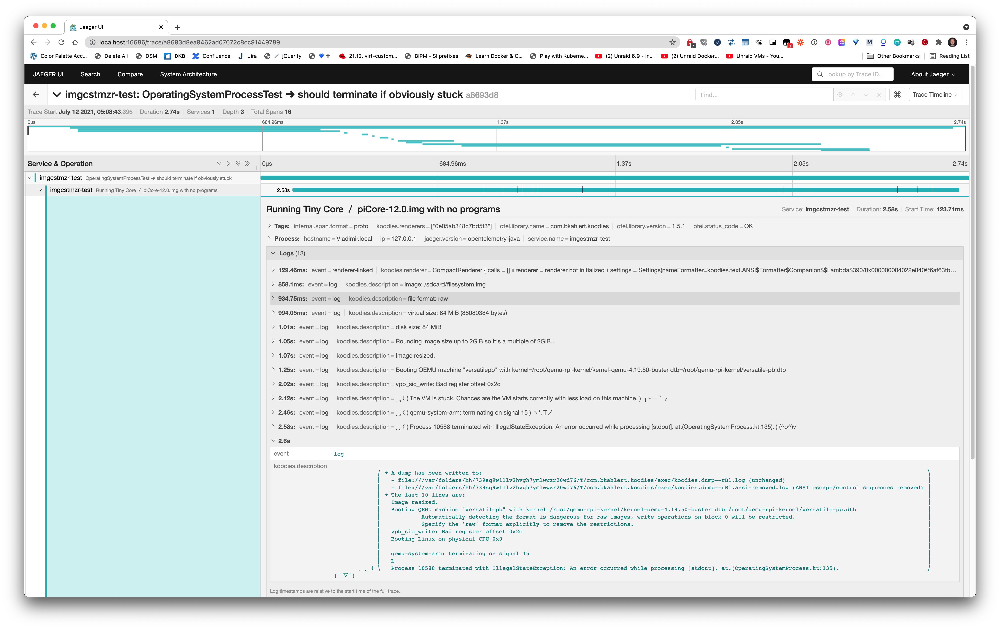
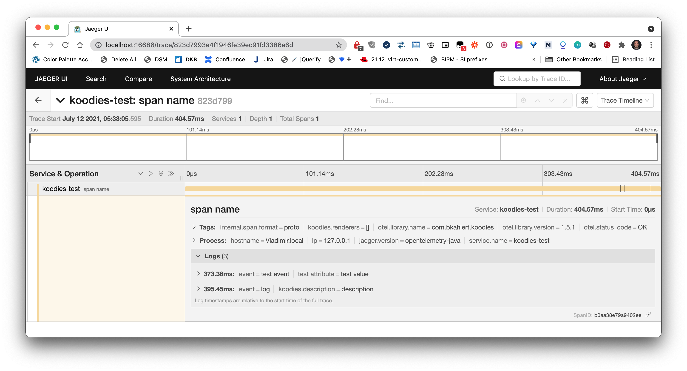
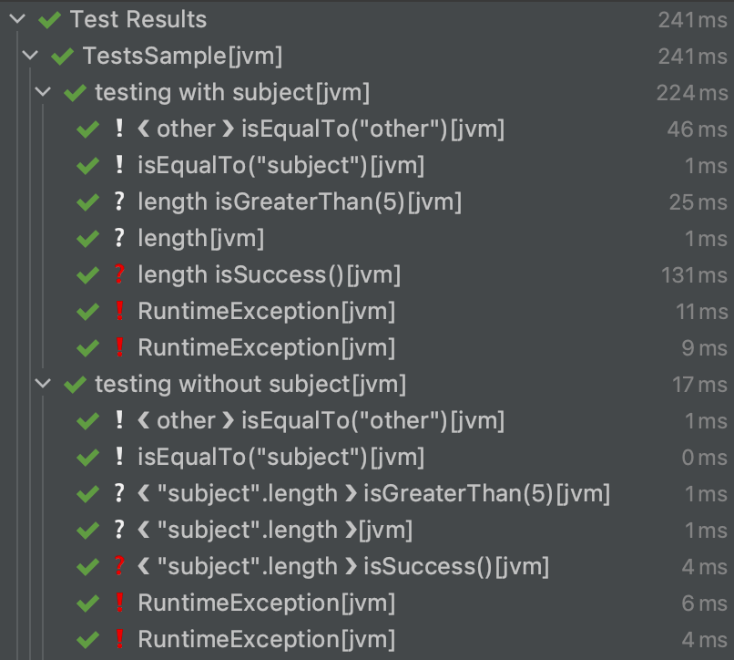
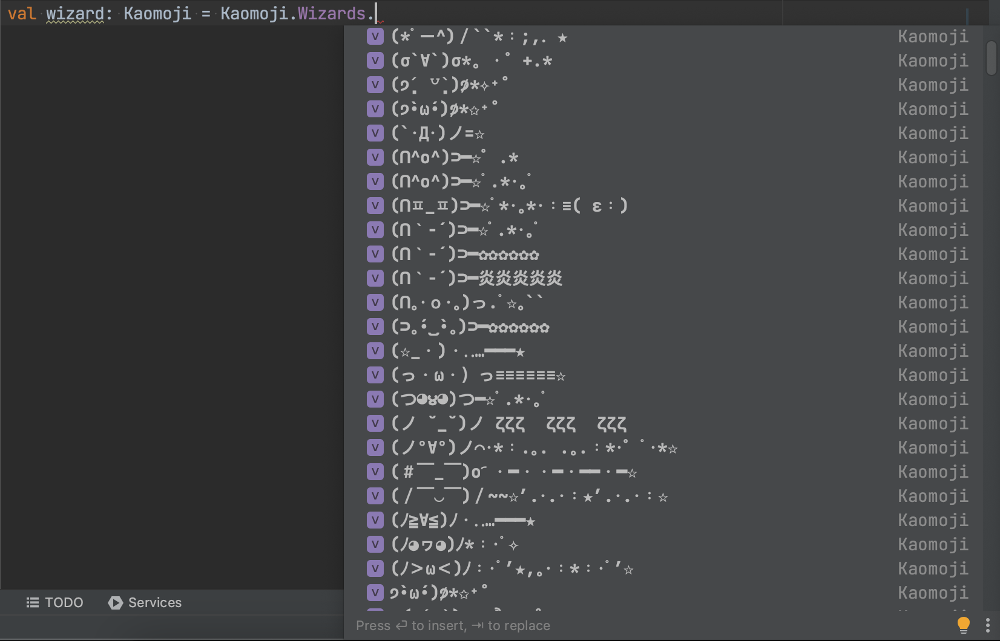

# Koodies [![Download from Maven Central](https://img.shields.io/maven-central/v/com.bkahlert/koodies?color=FFD726&label=Maven%20Central&logo=data%3Aimage%2Fsvg%2Bxml%3Bbase64%2CPD94bWwgdmVyc2lvbj0iMS4wIiBlbmNvZGluZz0idXRmLTgiPz4KPCEtLSBHZW5lcmF0b3I6IEFkb2JlIElsbHVzdHJhdG9yIDI1LjEuMCwgU1ZHIEV4cG9ydCBQbHVnLUluIC4gU1ZHIFZlcnNpb246IDYuMDAgQnVpbGQgMCkgIC0tPgo8c3ZnIHZlcnNpb249IjEuMSIgaWQ9IkxheWVyXzEiIHhtbG5zPSJodHRwOi8vd3d3LnczLm9yZy8yMDAwL3N2ZyIgeG1sbnM6eGxpbms9Imh0dHA6Ly93d3cudzMub3JnLzE5OTkveGxpbmsiIHg9IjBweCIgeT0iMHB4IgoJIHZpZXdCb3g9IjAgMCA1MTIgNTEyIiBzdHlsZT0iZW5hYmxlLWJhY2tncm91bmQ6bmV3IDAgMCA1MTIgNTEyOyIgeG1sOnNwYWNlPSJwcmVzZXJ2ZSI%2BCjxnPgoJPGRlZnM%2BCgkJPHBhdGggaWQ9IlNWR0lEXzFfIiBkPSJNMTAxLjcsMzQ1LjJWMTY3TDI1Niw3Ny45TDQxMC40LDE2N3YxNzguMkwyNTYsNDM0LjNMMTAxLjcsMzQ1LjJ6IE0yNTYsNkwzOS42LDEzMS4ydjI0OS45TDI1Niw1MDYKCQkJbDIxNi40LTEyNC45VjEzMS4yTDI1Niw2eiIvPgoJPC9kZWZzPgoJPHVzZSB4bGluazpocmVmPSIjU1ZHSURfMV8iICBzdHlsZT0ib3ZlcmZsb3c6dmlzaWJsZTtmaWxsOiNGRkZGRkY7Ii8%2BCgk8Y2xpcFBhdGggaWQ9IlNWR0lEXzJfIj4KCQk8dXNlIHhsaW5rOmhyZWY9IiNTVkdJRF8xXyIgIHN0eWxlPSJvdmVyZmxvdzp2aXNpYmxlOyIvPgoJPC9jbGlwUGF0aD4KPC9nPgo8L3N2Zz4K)](https://search.maven.org/search?q=g:com.bkahlert%20AND%20a:koodies)  [](https://github.com/bkahlert/koodies/releases/latest) [](https://github.com/bkahlert/koodies) [](https://github.com/bkahlert/koodies/blob/master/LICENSE)

<!-- C21E73 -->

**Koodies is a Kotlin Multiplatform Library, with a minimal set of dependencies, allowing you to run Command Lines and Shell Scripts, locally or in a Docker
Container—and a dozen of other features like various builders, an improved Java NIO 2 integration, decimal and binary units, Unicode-aware string functions and
stuff the world doesn't need `Kaomoji.Heroes.‾͟͟͞(((ꎤ ✧曲✧)̂—̳͟͞͞o`.**

## Installation / Setup

Koodies is hosted on GitHub with releases provided on Maven Central.

* **Gradle** `implementation("com.bkahlert:koodies:1.7.0-dev.0.uncommitted+7835c8f")`

* **Maven**
  ```xml
  <dependency>
      <groupId>com.bkahlert</groupId>
      <artifactId>koodies</artifactId>
      <version>1.7.0-dev.0.uncommitted+7835c8f</version>
  </dependency>
  ```

## Features

### OpenTelemetry Integration *(since 1.6.0)*

The observability library [OpenTelemetry](https://opentelemetry.io/) is natively supported. Simply start a process and watch for yourself:

[](assets/Tracing-DockerPi.png)

For manual instrumentation, the `spanning` function is provided:

```kotlin
spanning("span name") {
    event("test event", Key.stringKey("test attribute") to "test value")
    log("description") // = event("log", RenderingAttributes.DESCRIPTION to description)
    42 // = return value
}
```

[](assets/Tracing-SimpleSpan.png)

By default, the span and all events with a description are also printed to the console:

```text
╭──╴span name
│
│   description                                                                 
│
╰──╴✔︎
```

### Kotlin 1.5 Duration Extensions *(since 1.5.1)*

Those of you missing the [duration extension removed in Kotlin 1.5](https://kotlinlang.org/docs/whatsnew15.html#duration-api-changes) may sigh of relief, since
Koodies 1.5.1 brings them back:

```kotlin
42.days + 42.hours + 42.minutes + 42.seconds // 43.8d
42.milli.seconds + 450.micro.seconds + 50_000.nano.seconds // 42.5ms 
```

### Exec: Feature-Rich Process Execution *(since 1.5.0)*

#### ⌨️ *Execute* Command Lines *on* Host

```kotlin
CommandLine("printenv", "HOME")
    .exec() // .exec.logging() // .exec.processing { io -> … } 
```

#### 📄 *Execute* Shell Scripts *on* Host

```kotlin
ShellScript { "printenv | grep HOME | perl -pe 's/.*?HOME=//'" }
    .exec() // .exec.logging() // .exec.processing { io -> … }
```

#### 🐳 *Execute* Command Lines *in* Docker Container

```kotlin
CommandLine("printenv", "HOME").dockerized { "ubuntu" }
    .dockerized { "ubuntu" }
    .exec() // .exec.logging() // .exec.processing { io -> … }
```

*or even simpler*

```kotlin
with(tempDir()) { // working directory provided via receiver
    ubuntu("printenv", "HOME") // busybox
        .exec() // .exec.logging() // .exec.processing { io -> … }
}
```

#### 🐳 *Execute* Shell Scripts *in* Docker Container

```kotlin
ShellScript { "printenv | grep HOME | perl -pe 's/.*?HOME=//'" }
    .dockerized { "ubuntu" }
    .exec() // .exec.logging() // .exec.processing { io -> … }
```

*or even simpler*

```kotlin
with(tempDir()) { // working directory provided via receiver
    ubuntu { "printenv | grep HOME | perl -pe 's/.*?HOME=//'" } // busybox
        .exec() // .exec.logging() // .exec.processing { io -> … }
}
```

#### How can you run?

##### Degree of Interaction

###### ▶️ executing-only

```kotlin
CommandLine("…") // ShellScript { … }
    .exec()
```

###### 📝 logging

```kotlin
CommandLine("…") // ShellScript { … }
    .exec.logging()
```

- If things go wrong, it's also logged:
  ```text
  Process {PID} terminated with exit code {…}
  ➜ A dump has been written to:
  - {TempDir}/koodies/exec/dump.{}.log
  - {TempDir}/koodies/exec/dump.{}.ansi-removed.log
    ➜ The last 10 lines are:
    {…}
    3
    2
    1
    Boom!
  ```  

###### 🧠 processing

```kotlin
CommandLine("…") // ShellScript { … }
    .exec.processing { io -> doSomething(io) }`
```

- `io` is typed; simply use `io is IO.Output` to filter out errors and meta information

##### Synchronicity

###### 👯‍♀️ 👯‍♂️ synchronous

```kotlin
CommandLine("…") // ShellScript { … }
    .exec() // .exec.logging() // .exec.processing { io -> … }
```

###### 💃 🕺 asynchronous

```kotlin
CommandLine("…") // ShellScript { … }
    .exec.async() // .exec.async.logging() // .exec.async.processing { io -> … }
```

#### Features

##### Automatically Captured I/O

Whatever variant you choose, life-cycle events, sent input, the process's output and errors are stored for you:

```kotlin
CommandLine(…).exec().io
CommandLine(…).exec().io.output
CommandLine(…).exec().io.error.ansiRemoved
```

##### Typed (Exit) State

- Access the state with `state`, which is either an instance of `Running`, `Exited`
  (with the sub states `Succeeded` and `Failed`) or `Excepted`.
- All states print nicely and provide a copy of all logged I/O, and state-dependent information such as the exit code.
- By default, processes are killed on VM shutdown, which can be configured.
- Life-cycle callbacks can be registered.

##### Ready to run Docker commands

```kotlin
with(tempDir()) {
    SvgFile.copyTo(resolve("koodies.svg"))

    // convert SVG to PNG using command line-style docker command
    docker("minidocks/librsvg", "-z", 5, "--output", "koodies.png", "koodies.svg")

    // convert PNG to ASCII art using shell script-style docker command
    docker("rafib/awesome-cli-binaries", logger = null) {
        """
           /opt/bin/chafa -c full -w 9 koodies.png
        """
    }.io.output.ansiKept.resetLines().let { println(it) }
}
```

###### Output

<!-- @formatter:off -->
```text
⧹kyTTTTTTTTTTTTTTTTTTTTuvvvvvvvvvvvvvvvvvvvvvvvv.  
RR⧹kyTTTTTTTTTTTTTTTTTvvvvvvvvvvvvvvvvvvvvvvvv.
BBRR⧹kyTTTTTTTTTTTTTvvvvvvvvvvvvvvvvvvvvvvvv.
BBBBRR⧹kyTTTTTTTTTvvvvvvvvvvvvvvvvvvvvvvvv.
BBBBBBRR⧹kyTTTTTvvvvvvvvvvvvvvvvvvvvvvvv.
BBBBBBBBRR⧹kyTx/vvvvvvvvvvvvvvvvvvvvvv.
BBBBBBBBBBRZ⧹/vvvvvvvvvvvvvvvvvvvvvv.
BBBBBBBBBBQxvvvvvvvvvvvvvvvvvvvvvv.
BBBBBBBB&xvvvvvvvvvvvvvvvvvvvvvv.
BBBBBBZzvvvvvvvvvvvvvvvvvvvvvv.
BBBBZuvvvvvvvvvvvvvvvvvvvvvv▗▄▄▄▄▄▄▄▄▄▄▄▄▄▄▄▄▄▄▄▄▄
BBZTvvvvvvvvvvvvvvvvvvvvvv. ▝▜MMMMMMMMMMMMMMMMMMMM
R3vvvvvvvvvvvvvvvvvvvvvv.    .▝▜MMMMMMMMMMMMMMMMMM
vvvvvvvvvvvvvvvvvvvvvv.        .▝▜MMMMMMMMMMMMMMMM
vvvvvvvvvvvvvvvvvvvv.            .▝▜MMMMMMMMMMMMMM
uxvvvvvvvvvvvvvvvvz3x_              ▝▜MMMMMMMMMMMM
▁3uxvvvvvvvvvvvv▁▅&▆▂gx`              ▝▜MMMMMMMMMM
Z▅▁3uxvvvvvvvvz▆WWRZ&▆▂gv.             `▀WMMMMMMMM
WR&▄▁3uxvvvvvuk▀BWWWRZ&▆▂gv.         ./vvz▀WMMMMMM
WWWRZ▅▁3ux▁▂Zg33k▀BWWWRZ&▆▂g}.     ./vvvvvvz▀WMM0W
000WWRZ▅▃▆MM▆▂Zg33k▀BWWWRZ&▆▂g}. ./vvvvvvvvvvx▀BBR
00000WMMMMMMMM▆▂Zg33k▀BWWWRZ&▆▂yxxvvvvvvvvvvvvvx▝▀
0000MMMMMMMMMMMM▆▂Zg33k▀BWWWRZ▆▆▂gTxvvvvvvvvvvvvvx
00MMMMMMMMMMMMMMMM▆▂Zg33k▀BWWWRZ&▆▂gTxvvvvvvvvvvvv
MMMMMMMMMMMMMMMMMMMM▆▂Zg33g▀BWWWRZ&▆▂gTxvvvvvvvvvv
```
<!-- @formatter:on -->

- All docker commands (`docker`, `ubuntu`, `busybox`, `curl`, `download`, `nginx`, …) use the path in the receiver to
    - set the working directory of both the host command and the docker container
    - map the host working directory to the container's working directory,
    - that is, all files of that directory are equally available in your container instance.
- Low-level docker commands: `start`, `run`, `stop`, `kill`, `remove`, `search`, `image`, `ps`
- Object-oriented design
    - [Docker](src/jvmMain/kotlin/koodies/docker/Docker.kt): `engineRunning`, `info`, `images`, `containers`, `search`, `exec`
    - [DockerImage](src/jvmMain/kotlin/koodies/docker/DockerImage.kt): `list`, `isPulled`, `pull`, `tagsOnDockerHub`
    - [DockerContainer](src/jvmMain/kotlin/koodies/docker/DockerContainer.kt): `start`, `stop`, `state`, `kill`, `remove`
- See [ExecutionIntegrationTest.kt](src/jvmTest/kotlin/koodies/ExecutionIntegrationTest.kt) and
  [Docker.kt](src/jvmMain/kotlin/koodies/docker/Docker.kt) for more examples.

### JUnit + Strikt Integration + Automatically Named Tests

```kotlin
class Tests {

    @TestFactory
    fun `testing with subject`() = test("subject") {

        "other" asserting { isEqualTo("other") }
        asserting { isEqualTo("subject") }
        expecting { length } that { isGreaterThan(5) }
        expecting { length }
            .that { isGreaterThan(5) }
        expectCatching { length } that { isSuccess() }
        expectThrows<RuntimeException> { throw RuntimeException() }
        expectThrows<RuntimeException> { throw RuntimeException() } that { message.isNullOrEmpty() }
    }

    @TestFactory
    fun `testing without subject`() = tests {

        "other" asserting { isEqualTo("other") }
        asserting("subject") { isEqualTo("subject") }
        expecting { "subject".length } that { isGreaterThan(5) }
        expecting { "subject".length }
            .that { isGreaterThan(5) }
        expectCatching { "subject".length } that { isSuccess() }
        expectThrows<RuntimeException> { throw RuntimeException() }
        expectThrows<RuntimeException> { throw RuntimeException() } that { message.isNullOrEmpty() }
    }
}
```

[](assets/JUnit-Strikt-Naming.png)

### Multi-Platform Builders

#### Array Builder

```kotlin
val array = buildArray {
    add("test")
    add("𓌈🥸𓂈")
}
```

#### List Builder

```kotlin
val array = buildList {
    add("test")
    add("𓌈🥸𓂈")
}
```

#### Set Builder

```kotlin
val array = buildSet {
    add("test")
    add("𓌈🥸𓂈")
}
```

#### Map Builder

```kotlin
val array = buildMap {
    "ten" to 3
    "𓌈🥸𓂈".let { it to it.length }
}
```

### IP Address Tooling (4 & 6)

```kotlin
val ip4 = ipOf<IPv4Address>("192.168.16.25")
val ip6 = ip4.toIPv6Address()
val range = ip6.."::ffff:c0a8:1028".toIp() // ::ffff:c0a8:1019..::ffff:c0a8:1028
val subnet = ip6 / 122 // ::ffff:c0a8:1000/122
check(range.smallestCommonSubnet == subnet) // ✔︎
check(subnet.broadcastAddress.toInetAddress().isSiteLocalAddress) // ✔︎
```

### Improved Java NIO 2 Integration

#### Access the Class Path

```kotlin
classPath("file.svg").copyTo(somewhere)
```

#### Copy and Delete Recursively

```kotlin
directory.copyRecursivelyTo(somewhere)
```

```kotlin
directory.deleteRecursively()
```

#### Fluent API

```kotlin
if (path.notExists()) path.withDirectoriesCreated().createFile()
```

#### Non-Blocking DynamicInputStream & DynamicReadableByteChannel

```kotlin
val inputStream = DynamicInputStream()
// Data can be yielded everytime you want until you call close().
inputStream.yield("Hello World!".toByteArray())
// Stream effectively closes only after all data have been read.
inputStream.close()

val bytes = inputStream.readBytes()

expectThat(bytes).isEqualTo("Hello World!".toByteArray())
```

Same functionality provided by `DynamicReadableByteChannel`.

### Units

#### Kotlin 1.5 Duration Extensions

```kotlin
42.days
42.hours
42.minutes
42.seconds
42.milli.seconds
42.micro.seconds
42.nano.seconds
```

#### Decimal and Binary Bytes

```kotlin
10.Yobi.bytes > 10.Yotta.bytes
```

#### Arithmetics

```kotlin
3.Tera.bytes + 200.Giga.bytes == 3.2.Tera.bytes
2 * 3.Kibi.bytes == 6.Kibi.bytes
```

#### File and Directory Size

```kotlin
Path.of("/tmp").getSize() // 1.9 TB
listOf(largeFile, smallFile, mediumFile).sortedBy { it.getSize() }
```

#### From and to String

```kotlin
1.25.Mega.bytes.toString() == "1.25 MB"
"1.25 MB".toSize() == 1.25.Mega.bytes
4_200_000.Yobi.bytes.toString(BinaryPrefix.Mebi, 4) == "4.84e+24 MiB"
```

#### Useless Nerd Stuff

```kotlin
42.hecto.bytes
42.mebi.days
```

### More…

* Logging
  ```kotlin
  logging {
    logLine { "lazy log message" }
  }
  ```

* Fixtures

  **In-Memory**
  ```kotlin
  object HtmlFile : Fixture by TextFixture("example.html", 
    """
      <html>
      …
      </html>
    """.trimIndent())
  
  HtmlFile.copyTo(Locations.Temp)
  ```

  **Jar / Class Path**
  ```kotlin
  object META_INF : ClassPathDirectoryFixture("META-INF") {
      object Services : Dir("services") {
          object JUnitExtensions : File("org.junit.jupiter.api.extension.Extension")
      }
  }
  
  println(META_INF.Services.JUnitExtensions.text)
  ```

* Constrained Functions
  ```kotlin
  class A {
    val work by callable(atMost=2) {
      doSomething()
    }
  }
  
  A().apply {
    work() // calls doSomething()
    work() // calls doSomething()
    work() // only returns result of last call
  }
  ```

* Time
  ```kotlin
  Now.emoji // :clock230: (= emoji showing the correct time) 
  ```

  ```kotlin
  if(file.age > 3.minutes) …
  ```

* Unicode & Code Points

  **Named Characters and Dictionary**
  ```kotlin
  Unicode.BoxDrawings.asTable()
  ```
  ```shell
  ─	BOX DRAWINGS LIGHT HORIZONTAL
  ━	BOX DRAWINGS HEAVY HORIZONTAL
  │	BOX DRAWINGS LIGHT VERTICAL
  ┃	BOX DRAWINGS HEAVY VERTICAL
  …
  ```  

  **Process Each Actual Character** (and not each `char`)
  ```kotlin
  "aⒷ☷👩‍👩‍👧‍👧".asCodePointSequence() -> "a", "Ⓑ", "☷", ":woman:" ZWJ, ":woman:", ZWJ, ":girl:", ZWJ, ":girl:"
  ```

* Colors & Formatting
  ```shell
  "string in".ansi.cyan + "or" + "bold".ansi.bold
  ```

* Kaomoji
  ```kotlin
  Kaomoji.Wizards.`(#-_-)o´・━・・━・━━・━☆`.random()
  ```
  [](assets/Kaomoji.png)

* Borders, Boxes, …

  ```shell
   ╭───────────────────────────────────────────────────╮ 
   │                                                   │ 
   │        Done. All tests passed within 1.20s        │ 
   │                                                   │ 
   ╰───────────────────────────────────────────────────╯ 
  ```

  ```shell
    ▄▄▄▄▄▄▄▄▄▄▄▄▄▄▄▄
    ████▌▄▌▄▐▐▌█████
    ████▌▄▌▄▐▐▌▀████
    ▀▀▀▀▀▀▀▀▀▀▀▀▀▀▀▀
  ```

* Debugging

  Check if your program currently runs in debugging mode.
  ```kotlin
  if(isDebugging) { … }
  ```

  Use `debug` to check what's actually inside a `String`:
  ```kotlin
  "a  b
".debug // a ❲THREE-PER-EM SPACE❳ b ⏎␊
  "�" // D800▌﹍ (low surrogate with a missing high surrogate)
  ```

  Use `trace` to print stuff without interrupting the call chain:
  ```kotlin
  chain().of.endless().calls()
  
  // print return value of endless()
  chain().of.endless().trace.calls() 
  
  // prints return value of endless() formatted with debug
  chain().of.endless().trace { debug }.calls() 
  ```
    - Never look for orphaned print statements again. trace is declared as deprecated and inflicts a build warning.  
      `w: Koodies.kt: (42, 15): 'trace: T' is deprecated. Don't forget to remove after you finished debugging.`
    - trace has `replaceWith` set so that in IntelliJ the cleanup action removes all trace statements in one stroke.
    - Each trace statement prints the file and line it was called at.  
      `.ͥ (Koodies.kt:42) ⟨ … ⟩`

* Line Separators are defined in the [LineSeparators](src/commonMain/kotlin/koodies/text/LineSeparators.kt)
  and [Unicode](src/commonMain/kotlin/koodies/text/Unicode.kt) object

  ```kotlin
  LineSeparators.toList() == listOf(
    LineSeparators.CRLF, // carriage return + line feed (\r\n)
    LineSeparators.LF,   // line feed (\n)
    LineSeparators.CR,   // carriage return (\r)
    LineSeparators.NL,   // next line 
    LineSeparators.PS,   // paragraph separator 
    LineSeparators.LS,   // line separator
  )
  ```

  Split string into its lines…
  ```kotlin
  """
  line 1
  line 2
  
  """.lines() // line 1, line 2 
  ```

  Split string into its lines lazily and keep the line separator…
    ```kotlin
    """
    line 1
    line 2
  
    """.lineSequence(keepDelimiters=true) // line 1⏎␤, line 2⏎␍␊ 
    ```

----
**Upgrading**

```shell
# upgrade gradle
./gradlew wrapper --gradle-version=7.0.2 --distribution-type=bin
```

**Releasing**  
[RELEASING.md](RELEASING.md)
