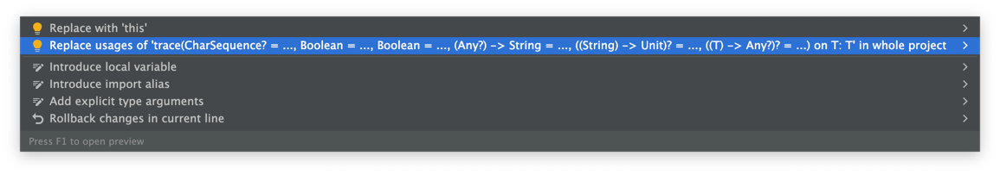

# Kommons [![Download from Maven Central](https://img.shields.io/maven-central/v/com.bkahlert.kommons/kommons-debug?color=FFD726&label=Maven%20Central&logo=data%3Aimage%2Fsvg%2Bxml%3Bbase64%2CPD94bWwgdmVyc2lvbj0iMS4wIiBlbmNvZGluZz0idXRmLTgiPz4KPCEtLSBHZW5lcmF0b3I6IEFkb2JlIElsbHVzdHJhdG9yIDI1LjEuMCwgU1ZHIEV4cG9ydCBQbHVnLUluIC4gU1ZHIFZlcnNpb246IDYuMDAgQnVpbGQgMCkgIC0tPgo8c3ZnIHZlcnNpb249IjEuMSIgaWQ9IkxheWVyXzEiIHhtbG5zPSJodHRwOi8vd3d3LnczLm9yZy8yMDAwL3N2ZyIgeG1sbnM6eGxpbms9Imh0dHA6Ly93d3cudzMub3JnLzE5OTkveGxpbmsiIHg9IjBweCIgeT0iMHB4IgoJIHZpZXdCb3g9IjAgMCA1MTIgNTEyIiBzdHlsZT0iZW5hYmxlLWJhY2tncm91bmQ6bmV3IDAgMCA1MTIgNTEyOyIgeG1sOnNwYWNlPSJwcmVzZXJ2ZSI%2BCjxnPgoJPGRlZnM%2BCgkJPHBhdGggaWQ9IlNWR0lEXzFfIiBkPSJNMTAxLjcsMzQ1LjJWMTY3TDI1Niw3Ny45TDQxMC40LDE2N3YxNzguMkwyNTYsNDM0LjNMMTAxLjcsMzQ1LjJ6IE0yNTYsNkwzOS42LDEzMS4ydjI0OS45TDI1Niw1MDYKCQkJbDIxNi40LTEyNC45VjEzMS4yTDI1Niw2eiIvPgoJPC9kZWZzPgoJPHVzZSB4bGluazpocmVmPSIjU1ZHSURfMV8iICBzdHlsZT0ib3ZlcmZsb3c6dmlzaWJsZTtmaWxsOiNGRkZGRkY7Ii8%2BCgk8Y2xpcFBhdGggaWQ9IlNWR0lEXzJfIj4KCQk8dXNlIHhsaW5rOmhyZWY9IiNTVkdJRF8xXyIgIHN0eWxlPSJvdmVyZmxvdzp2aXNpYmxlOyIvPgoJPC9jbGlwUGF0aD4KPC9nPgo8L3N2Zz4K)](https://search.maven.org/search?q=g:com.bkahlert.kommons%20AND%20a:kommons-debug) [](https://github.com/bkahlert/kommons/releases/latest) <!--[](https://bintray.com/bkahlert/koodies/koodies/_latestVersion)--> [](https://github.com/bkahlert/kommons/actions/workflows/build.yml) [](https://github.com/bkahlert/kommons) [](https://github.com/bkahlert/kommons/blob/master/LICENSE)

<!-- C21E73 -->

## About

**Kommons Debug** is a Kotlin Multiplatform Library to help you debug. It adds:

1. powerful [print debugging](#print-debugging) functions:
    - [trace](#anytrace--anyinspect)
    - [inspect](#anytrace--anyinspect)
    - [render](#anyrender--anyasstring)
    - [renderType](#anyrendertype)
2. [runtime](#runtime) information on the running [program](#program), its [platform](#platform) and a
   platform-independent [stack trace](#stack-trace)
3. easily accessible [Unicode support](#unicode-support)
4. [string handling](#string-handling) functions
5. [regex](#regular-expressions) functions such as the possibility to use glob patterns
6. facilitated [time handling](#time-handling) using `Now`, `Yesterday`, and `Tomorrow`
7. [factories](#factories) to easily implement `of`/`ofOrNull`, `from`/`fromOrNull`, and `parse`/`parseOrNull`
8. [file handling](#file-handling-only-jvm) features such as locating source files and accessing the class path with the NIO2 API

## Installation / setup

Kommons Debug is hosted on GitHub with releases provided on Maven Central.

* **Gradle** `implementation("com.bkahlert.kommons:kommons-debug:0.14.0") { because("print debugging") }`

* **Maven**
  ```xml
  <dependency>
      <groupId>com.bkahlert.kommons</groupId>
      <artifactId>kommons-debug</artifactId>
      <version>0.14.0</version>
  </dependency>
  ```

## Features

### Print Debugging

#### Any?.trace / Any?.inspect

Print tracing information and easily cleanup afterward using
IntelliJ's code cleanup feature.

##### Example

```kotlin
data class Foo(val bar: String = "baz") {
    private val baz = 42.0
    fun compute() // used to demonstrate that trace/inspect return their argument unchanged
}

Foo().trace.compute()
// output: (sample.kt:5) ⟨ Foo(bar=baz) ⟩

Foo().trace("caption").compute()
// output: (sample.kt:8) caption ⟨ Foo(bar=baz) ⟩

Foo().trace("details") { it.bar.reversed() }.compute()
// output: (sample.kt:11) details ⟨ Foo(bar=baz) ⟩ { "zab" }

Foo().inspect.compute()
// output: (sample.kt:14) ⟨ !Foo { baz: !Double 42.0, bar: !String "baz" } ⟩

Foo().inspect("caption").compute()
// output: (sample.kt:17) caption ⟨ !Foo { baz: !Double 42.0, bar: !String "baz" } ⟩

Foo().inspect("details") { it.bar.reversed() }.compute()
// output: (sample.kt:20) details ⟨ !Foo { baz: !Double 42.0, bar: !String "baz" } ⟩ { !String "zab" }
```



The examples above also work in browsers:


#### Any.renderType()

Renders any object's type

##### Examples

```kotlin
"string".renderType()               // String

class Foo(val bar: Any = "baz")
foo().renderType()                  // Foo

val lambda: (String) -> Unit = {}
lambda.renderType()                 // (String)->Unit
```

#### Any?.render() / Any.asString()

Renders any object depending on whether its `toString()` is overridden:

- If there is a custom `toString()` it's simply used.
- if there is *no custom* `toString()` the object is serialized in the form structurally

##### Examples

```kotlin
"string".render()                              // string

class Foo(val bar: Any = "baz")

foo().render()                                 // { bar: "baz" }
foo(foo()).render(typed = true)                // Foo { bar: Foo { bar: "baz" } }

foo().asString()                               // { bar: "baz" }
foo(null).asString(excludeNullValues = false)  // { }
```

#### Any?.asEmoji()

Renders any object as an emoji.

##### Examples

```kotlin
null.asEmoji()       //  "❔"
true.asEmoji()       //  "✅"
false.asEmoji()      //  "❌"
Now.asEmoji()        //  "🕝"
Now.asEmoji(Floor)   //  "🕑"
"other".asEmoji()    //  "🔣"
```

#### Any.properties

Contains a map of the object's properties with each entry representing
the name and value of a property.

##### Examples

```kotlin
"string".properties               // { length: 6 }

class Foo(val bar: Any = "baz")
foo().properties                  // { bar: "baz" }
foo(foo()).properties             // { bar: { bar: "baz" } }
```

#### URL / URI / Path / File // open / locate \[only JVM\]

Any `URL`, `URI`, `Path` and `File` can be opened locally using `open`.

```kotlin
URL("file:///home/john/dev/project/src/jvm/kotlin/packages/source.kt").open()
```

In order to only open the directory containing an above-mentioned resource
`locate` can be used.

```kotlin
URL("file:///home/john/dev/project/src/jvm/kotlin/packages/source.kt").locate()
```

### Runtime

#### Program

Reflects the running program and provides:

- `Program.isDebugging`: Returns whether the program is running in debug mode.
- `Program.isIntelliJ`: Returns whether the program is running in IntelliJ.
- `Program.onExit`: Allows registering callbacks that are invoked when the program exits.

#### Platform

Reflects the platform the program runs on (e.g. `Platform.JVM`)
and provides:

- `Platform.ansiSupport`: Returns to what extent ANSI escape codes are supported.
- `Platform.fileSeparator`: Returns the separator used to separate path segments.

#### Stack Trace

Access the current stack trace by a simple call to `StackTrace.get()`
or locate a specific caller using `StackTrace.get().findLastKnownCallOrNull`.

##### Examples

```kotlin
fun foo(block: () -> StackTraceElement?) = block()
fun bar(block: () -> StackTraceElement?) = block()

foo { bar { StackTrace.findLastKnownCallOrNull("bar") } }?.function  // "foo"
foo { bar { StackTrace.findLastKnownCallOrNull(::bar) } }?.function  // "foo"
```

### Unicode Support

Handling user input requires functions to handle Unicode correctly,
unless you're not afraid of the following:

```kotlin
"👨🏾‍🦱".substring(0, 3) // "👨?", skin tone gone, curly hair gone
"👩‍👩‍👦‍👦".substring(1, 7) // "?‍👩‍?", wife gone, kids gone
```

Decode any string to a sequence / list of code points using `String.asCodePointSequence` / `String.toCodePointList`.

Decode any string to a sequence / list of graphemes using `String.asGraphemeSequence` / `String.toGraphemeList`.

Transliterations and transforms can be done using `String.transform`.

#### Examples

```kotlin
"a".asCodePoint().name     // "LATIN SMALL LETTER A"
"a𝕓c̳🔤".toCharArray()      // "a", "?", "?", "c", "̳", "?", "?"
"a𝕓c̳🔤".toCodePointList()  // "a", "𝕓", "c", "̳", "🫠"
"a𝕓c̳🔤".toGraphemeList()   // "a", "𝕓", "c̳", "🫠"

"a𝕓🫠🇩🇪👨🏾‍🦱👩‍👩‍👦‍👦".length                    // 27 (= number of Java chars)
"a𝕓🫠🇩🇪👨🏾‍🦱👩‍👩‍👦‍👦".asText(CodePoint).length  // 16 (= number of Unicode code points)
"a𝕓🫠🇩🇪👨🏾‍🦱👩‍👩‍👦‍👦".asText(Grapheme).length   //  6 (= visually perceivable units)

"a𝕓🫠🇩🇪👨🏾‍🦱👩‍👩‍👦‍👦".truncate(7.characters)  // "a\uD835 … 👦"
"a𝕓🫠🇩🇪👨🏾‍🦱👩‍👩‍👦‍👦".truncate(7.codePoints)  // "a𝕓 … ‍👦"
"a𝕓🫠🇩🇪👨🏾‍🦱👩‍👩‍👦‍👦".truncate(7.graphemes)   // "a𝕓 … 👨🏾‍🦱👩‍👩‍👦‍👦"

"© А-З Ä-ö-ß".transform("de_DE", "de_DE-ASCII")  // "(C) A-Z AE-oe-ss"
```

#### UTF-16 Char *vs* Code Point *vs* Grapheme Cluster

|                 UTF-16                  | Char<br/>(Java, JavaScript, Kotlin, ...)             | Unicode<br/>Code Point                    | Unicode<br/>Grapheme Cluster |
|:---------------------------------------:|------------------------------------------------------|-------------------------------------------|------------------------------|
|                 \u0061                  | a (LATIN SMALL LETTER A)                             | a                                         | a                            |
|            \uD835<br/>\uDD53            | 𝕓 (MATHEMATICAL DOUBLE-STRUCK SMALL B)              | 𝕓                                        | 𝕓                           |
| \uD83E<br/>\uDEE0<br/>\uD83C<br/>\uDDE9 | ? (HIGH SURROGATES D83E)<br/>? (LOW SURROGATES DEE0) | 🫠 (MELTING FACE EMOJI)                   | 🫠                           |
|            \uD83C<br/>\uDDE9            | ? (HIGH SURROGATES D83C)<br/>? (LOW SURROGATES DDE9) | \[D] (REGIONAL INDICATOR SYMBOL LETTER D) | 🇩🇪                         |
|            \uD83C<br/>\uDDEA            | ? (HIGH SURROGATES D83C)<br/>? (LOW SURROGATES DDEA) | \[E] (REGIONAL INDICATOR SYMBOL LETTER E) |                              |
|            \uD83D<br/>\uDC68            | ? (HIGH SURROGATES D83D)<br/>? (LOW SURROGATES DC68) | 👨 (MAN)                                  | 👨🏾‍🦱                      |
|            \uD83C<br/>\uDFFE            | ? (HIGH SURROGATES D83C)<br/>? (LOW SURROGATES DFFE) | 🏾 (EMOJI MODIFIER FITZPATRICK TYPE-5)    |                              |
|                 \u200D                  | \[ZWJ] (ZERO WIDTH JOINER)                           | \[ZWJ] (ZERO WIDTH JOINER)                |                              |
|            \uD83E<br/>\uDDB1            | ? (HIGH SURROGATES D83E)<br/>? (LOW SURROGATES DDB1) | 🦱 (EMOJI COMPONENT CURLY HAIR)           |                              |
|            \uD83D<br/>\uDC69            | ? (HIGH SURROGATES D83D)<br/>? (LOW SURROGATES DC69) | 👩 (WOMAN)                                | 👩‍👩‍👦‍👦                  |
|                 \u200D                  | \[ZWJ] (ZERO WIDTH JOINER)                           | \[ZWJ] (ZERO WIDTH JOINER)                |                              |
|            \uD83D<br/>\uDC69            | ? (HIGH SURROGATES D83D)<br/>? (LOW SURROGATES DC69) | 👩 (WOMAN)                                |                              |
|                 \u200D                  | \[ZWJ] (ZERO WIDTH JOINER)                           | \[ZWJ] (ZERO WIDTH JOINER)                |                              |
|            \uD83D<br/>\uDC66            | ? (HIGH SURROGATES D83D)<br/>? (LOW SURROGATES DC66) | 👦 (BOY)                                  |                              |
|                 \u200D                  | \[ZWJ] (ZERO WIDTH JOINER)                           | \[ZWJ] (ZERO WIDTH JOINER)                |                              |
|            \uD83D<br/>\uDC66            | ? (HIGH SURROGATES D83D)<br/>? (LOW SURROGATES DC66) | 👦 (BOY)                                  |                              |

### String Handling

- `quoted`: quotes and escapes an existing string
- `ansiRemoved`: removes ANSI escape sequences
- `spaced`/`startSpaced`/`endSpaced`: adds a space before and/or after a string if there isn't already one
- `truncate`/`truncateStart`/`truncateEnd`: truncates a string to a given length
- `toIdentifier`: create an identifier from any string that resembles it
- `randomString`: create a random string
- [LineSeparators](src/commonMain/kotlin/com/bkahlert/kommons/text/LineSeparators.kt): many extension functions to work with usual and exotic Unicode line
  breaks.

#### Examples

```kotlin
"string".quoted              // "string"
"""{ bar: "baz" }""".quoted  // "{ bar: \"baz\" }"

"""
line 1
"line 2"
""".quoted                   // "line1\n\"line2\""

"\u001B[1mbold \u001B[34mand blue\u001B[0m".ansiRemoved
// "bold and blue"

"\u001B[34m↗\u001B(B\u001B[m \u001B]8;;https://example.com\u001B\\link\u001B]8;;\u001B\\".ansiRemoved
// "↗ link"

"string".spaced              // " string "

"bar".withPrefix("foo")      // "foobar"
"foo bar".withPrefix("foo")  // "foo bar"
"foo".withSuffix("bar")      // "foobar"

"12345678901234567890".truncate()        // "123456 … 567890"
"12345678901234567890".truncateStart()   // " … 901234567890"
"12345678901234567890".truncateEnd()     // "123456789012 … "

"1👋 xy-z".toIdentifier()     // "i__xy-z3"

randomString()
// returns "Ax-212kss0-xTzy5" (16 characters by default) 
```

Capitalize / decapitalize strings using `capitalize`/`decapitalize` or
manipulate the case style using `toCasesString` or any of its specializations.

#### Examples

```kotlin
"fooBar".capitalize()    // "FooBar"
"FooBar".decapitalize()  // "fooBar"

"FooBar".toCamelCasedString()           // "fooBar"
"FooBar".toPascalCasedString()          // "FooBar"
"FooBar".toScreamingSnakeCasedString()  // "FOO_BAR"
"FooBar".toKebabCasedString()           // "foo-bar"
"FooBar".toTitleCasedString()           // "Foo Bar"

enum class FooBar { FooBaz }

FooBar::class.simpleCamelCasedName           // "fooBar"
FooBar::class.simplePascalCasedName          // "FooBar"
FooBar::class.simpleScreamingSnakeCasedName  // "FOO_BAR"
FooBar::class.simpleKebabCasedName           // "foo-bar"
FooBar::class.simpleTitleCasedName           // "Foo Bar"

FooBar.FooBaz.camelCasedName           // "fooBaz"
FooBar.FooBaz.pascalCasedName          // "FooBaz"
FooBar.FooBaz.screamingSnakeCasedName  // "FOO_BAZ"
FooBar.FooBaz.kebabCasedName           // "foo-baz"
FooBar.FooBaz.titleCasedName           // "Foo Baz
```

Easily check edge-case with a fluent interface as does `requireNotNull` does:

#### Examples

```kotlin
requireNotEmpty("abc")  // passes and returns "abc"
requireNotBlank("   ")  // throws IllegalArgumentException
checkNotEmpty("abc")    // passes and returns "abc"
checkNotBlank("   ")    // throws IllegalStateException
"abc".takeIfNotEmpty()  // returns "abc"
"   ".takeIfNotBlank()  // returns null
"abc".takeUnlessEmpty() // returns "abc"
"   ".takeUnlessBlank() // returns null
```

### Regular Expressions

`Regex` can be authored as follows:

```kotlin
Regex("foo") + Regex("bar")      // Regex("foobar") 
Regex("foo") + "bar"             // Regex("foobar")

Regex("foo") or Regex("bar")     // Regex("foo|bar") 
Regex("foo") or "bar"            // Regex("foo|bar")

Regex.fromLiteralAlternates(     // Regex("\\[foo\\]|bar\\?")
    "[foo]", "bar?"
)

Regex("foo").optional()          // Regex("(?:foo)?") 
Regex("foo").repeatAny()         // Regex("(?:foo)*") 
Regex("foo").repeatAtLeastOnce() // Regex("(?:foo)+") 
Regex("foo").repeat(2, 5)        // Regex("(?:foo){2,5}") 

Regex("foo").group()             // Regex("(?:foo)") 
Regex("foo").group("name")       // Regex("(?<name>foo)") 
```

Find matches easier:

```kotlin
// get group by name
Regex("(?<name>ba.)")
    .findAll("foo bar baz")
    .mapNotNull { it.groups["name"]?.value } // "bar", "baz"

// get group value by name
Regex("(?<name>ba.)")
    .findAll("foo bar baz")
    .map { it.groupValue("name") }           // "bar", "baz"

// find all values
Regex("(?<name>ba.)")
    .findAllValues("foo bar baz")            // "bar", "baz"

// match URLs / URIs
Regex.UrlRegex.findAll(/* ... */)
Regex.UriRegex.findAll(/* ... */)
```

Match multiline strings with simple glob patterns:

```kotlin
// matching within lines with wildcard
"foo.bar()".matchesGlob("foo.*")  // ✅

// matching across lines with multiline wildcard
"""
foo
  .bar()
  .baz()
""".matchesGlob(
    """
    foo
      .**()
    """.trimIndent()              // ✅
)

"""
foo
  .bar()
  .baz()
""".matchesGlob(
    """
    foo
      .*()
    """.trimIndent()              // ❌ (* doesn't match across lines)
)
```

Alternatively, you can use `matchesCurly` if you prefer SLF4J / Logback style
wildcards `{}` and `{{}}`.

### Collections and Ranges

Require or check emptiness of collections and arrays using `requireNotEmpty`
and `checkNotEmpty`.

Iterate any type of closed ranges using `asIterable`.

#### Examples

```kotlin
(-4.2..42.0)
    .asIterable { it + 9 }
    .map { it.toInt() } // [-4, 4, 13, 22, 31, 40]
```

### Time Handling

```kotlin
Now + 2.seconds     // 2 seconds in the future
Today - 3.days      // 3 days in the past
Yesterday - 2.days  // 3 days in the past
Tomorrow + 1.days   // the day after tomorrow
Instant.parse("1910-06-22T13:00:00Z") + 5.minutes // 1910-06-22T12:05:00Z
LocalDate.parse("1910-06-22") - 2.days            // 1910-06-20
SystemLocations.Temp.createTempFile().age         // < 1ms

Now.toMomentString()               // "now"
(Now - 12.hours).toMomentString()  // "12h ago"
(Now + 3.days).toMomentString()    // "in 3d"
(Today - 1.days).toMomentString()  // "yesterday"
```

### Byte Handling

#### toHexadecimalString(), toOctalString(), toBinaryString()

The extension functions

- `toHexadecimalString()`
- `toOctalString()`
- `toBinaryString()`

... are provided for:

- `Byte`
- `ByteArray`
- `Int`
- `Long`
- `UByte`
- `UByteArray`
- `UInt`
- `ULong`

##### Examples

```kotlin
val byteArray = byteArrayOf(0x00, 0x7f, -0x80, -0x01)
val largeByteArrayOf = byteArrayOf(-0x01, -0x01, -0x01, -0x01, -0x01, -0x01, -0x01, -0x01, -0x01, -0x01, -0x01, -0x01, -0x01, -0x01, -0x01, -0x01)
val veryLargeByteArray = byteArrayOf(0x01, 0x00, 0x00, 0x00, 0x00, 0x00, 0x00, 0x00, 0x00, 0x00, 0x00, 0x00, 0x00, 0x00, 0x00, 0x00, 0x00)

byteArray.map { it.toHexadecimalString() } // "00", "7f", "80", "ff"
byteArray.toHexadecimalString()            // "007f80ff"
largeByteArrayOf.toHexadecimalString()     // "ffffffffffffffffffffffffffffffff"
veryLargeByteArray.toHexadecimalString()   // "0100000000000000000000000000000000"

byteArray.map { it.toOctalString() } // "000", "177", "200", "377"
byteArray.toOctalString()            // "000177200377"
largeByteArrayOf.toOctalString()     // "377377377377377377377377377377377377377377377377"
veryLargeByteArray.toOctalString()   // "001000000000000000000000000000000000000000000000000"

byteArray.map { it.toBinaryString() } // "00000000", "01111111", "10000000", "11111111"
byteArray.toBinaryString()            // "00000000011111111000000011111111"
largeByteArrayOf.toBinaryString()     //         "111111111111111111111111111...111111"
veryLargeByteArray.toBinaryString()   // "00000001000000000000000000000000000...000000"
```

Further conversions:

- `Int.toByteArray()`
- `Long.toByteArray()`
- `UInt.toUByteArray()`
- `ULong.toUByteArray()`

#### Checksums

Compute `MD5`, `SHA-1`, and `SHA-256` checksums for arbitrary files.

##### Examples

```kotlin
val file = SystemLocations.Home / ".gitconfig"
file.md5Checksum()
file.sha1Checksum()
file.sha256Checksum()
```

### Factories

The [Factory interface](src/commonMain/kotlin/com/bkahlert/kommons/factories.kt) provides
the factory builders `creator`, `converter`, and `parser` to easily implement
the factory methods `of`/`ofOrNull`, `from`/`fromOrNull`, and `parse`/`parseOrNull`
as shown in the following example:

```kotlin
data class Version(val major: Int, val minor: Int, val patch: Int) {
    companion object : Parser<Version> by (parser {                 // The `parsing` method supports the following outcomes:
        it.split('.').let { (major, minor, patch) ->                // - return a `Version` instance in case of success 
            Version(major.toInt(), minor.toInt(), patch.toInt())    // - return `null` a generic ParsingException is thrown.
        }                                                           // - If you throw an exception it will be wrapped in a ParsingException.
    })
}

Version.parseOrNull("1.2.3")   // returns Version(1, 2, 3)
Version.parse("invalid")       // throws ParsingException: "Failed to parse "invalid" into an instance of Version"
```

### File Handling \[only JVM\]

Easily access your working directory with `SystemLocations.Work`,
your home directory with `SystemLocations.Home` and your system's
temporary directory with `SystemLocations.Temp`.

Create files with contents in one call using

- `createTextFile`
- `createBinaryFile`
- `createTempTextFile`
- `createTempBinaryFile`

Safely read files with
`useInputStream`, `useBufferedInputStream`, `useReader`, and `useBufferedReader`,
and write files with
`useOutputStream`, `useBufferedOutputStream`, `useWriter`, and `useBufferedWriter`.

Find the class directory, the source directory or the source file itself of a class.

#### Example

```kotlin
Foo::class.findClassesDirectoryOrNull()  // /home/john/dev/project/build/classes/kotlin/jvm/test
Foo::class.findSourceDirectoryOrNull()   // /home/john/dev/project/src/jvmTest/kotlin
Foo::class.findSourceFileOrNull()        // /home/john/dev/project/src/jvmTest/kotlin/packages/source.kt
```

Access class path resources like any other NIO 2 path using the `classpath` URI scheme.

#### Example

```kotlin
Paths.get("classpath:dir/to/resource").readText()
Paths.get("classpath:dir/to/resource").readBytes()
Paths.get("classpath:dir/to/resource").copyToDirectory(SystemLocations.Temp)
Paths.get("classpath:dir/to/resource").useBufferedReader { it.readLine() }
```

### Miscellaneous

#### Scaling

```kotlin
0.5.scale(+0.5)               // = +0.75 (0.5 scaled 50% closer to +1.0) 
0.5.scale(-0.5)               // = -0.25 (0.5 scaled 50% closer to -1.0) 

4.0.scale(+0.5, -10.0..+10.0)  // = +7.0 (4.0 scaled 50% closer to +10.0) 
4.0.scale(-0.5, -10.0..+10.0)  // = -4.0 (4.0 scaled 50% closer to -10.0) 
```

#### Either

Generic either type that can be used as a replacement for `Result`,
i.e. in cases where the alternative value doesn't necessarily mean failure.

Available methods are:

- `getLeftOrThrow` / `getRightOrThrow`
- `getLeftOrElse` / `getRightOrElse`
- `getLeftOrDefault` / `getRightOrDefault`
- `fold` / `mapLeft` / `mapRight`
- `onLeft` / `onLeft`
- `toResult` / `Result.toEither`

```kotlin
val foo: Either<Foo, Bar> = Left(Foo)
foo.getLeftOrThrow()   // returns Foo
foo.getRighttOrThrow() // throws an exception
```

## Contributing

Want to contribute? Awesome! The most basic way to show your support is to star the project, or to raise issues. You can also support this project by making
a [PayPal donation](https://www.paypal.me/bkahlert) to ensure this journey continues indefinitely!

Thanks again for your support, it is much appreciated! :pray:

## License

MIT. See [LICENSE](LICENSE) for more details.
