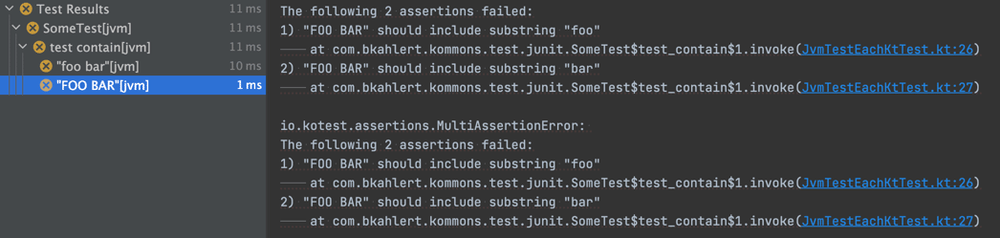

# Kommons Test [![Download from Maven Central](https://img.shields.io/maven-central/v/com.bkahlert.kommons/kommons-test?color=FFD726&label=Maven%20Central&logo=data%3Aimage%2Fsvg%2Bxml%3Bbase64%2CPD94bWwgdmVyc2lvbj0iMS4wIiBlbmNvZGluZz0idXRmLTgiPz4KPCEtLSBHZW5lcmF0b3I6IEFkb2JlIElsbHVzdHJhdG9yIDI1LjEuMCwgU1ZHIEV4cG9ydCBQbHVnLUluIC4gU1ZHIFZlcnNpb246IDYuMDAgQnVpbGQgMCkgIC0tPgo8c3ZnIHZlcnNpb249IjEuMSIgaWQ9IkxheWVyXzEiIHhtbG5zPSJodHRwOi8vd3d3LnczLm9yZy8yMDAwL3N2ZyIgeG1sbnM6eGxpbms9Imh0dHA6Ly93d3cudzMub3JnLzE5OTkveGxpbmsiIHg9IjBweCIgeT0iMHB4IgoJIHZpZXdCb3g9IjAgMCA1MTIgNTEyIiBzdHlsZT0iZW5hYmxlLWJhY2tncm91bmQ6bmV3IDAgMCA1MTIgNTEyOyIgeG1sOnNwYWNlPSJwcmVzZXJ2ZSI%2BCjxnPgoJPGRlZnM%2BCgkJPHBhdGggaWQ9IlNWR0lEXzFfIiBkPSJNMTAxLjcsMzQ1LjJWMTY3TDI1Niw3Ny45TDQxMC40LDE2N3YxNzguMkwyNTYsNDM0LjNMMTAxLjcsMzQ1LjJ6IE0yNTYsNkwzOS42LDEzMS4ydjI0OS45TDI1Niw1MDYKCQkJbDIxNi40LTEyNC45VjEzMS4yTDI1Niw2eiIvPgoJPC9kZWZzPgoJPHVzZSB4bGluazpocmVmPSIjU1ZHSURfMV8iICBzdHlsZT0ib3ZlcmZsb3c6dmlzaWJsZTtmaWxsOiNGRkZGRkY7Ii8%2BCgk8Y2xpcFBhdGggaWQ9IlNWR0lEXzJfIj4KCQk8dXNlIHhsaW5rOmhyZWY9IiNTVkdJRF8xXyIgIHN0eWxlPSJvdmVyZmxvdzp2aXNpYmxlOyIvPgoJPC9jbGlwUGF0aD4KPC9nPgo8L3N2Zz4K)](https://search.maven.org/search?q=g:com.bkahlert.kommons%20AND%20a:kommons-test) [](https://github.com/bkahlert/kommons/releases/latest) <!--[](https://bintray.com/bkahlert/koodies/koodies/_latestVersion)--> [](https://github.com/bkahlert/kommons/actions/workflows/build.yml) [](https://github.com/bkahlert/kommons) [](https://github.com/bkahlert/kommons/blob/master/LICENSE)

<!-- C21E73 -->


## About

**Kommons Test** is a Kotlin Multiplatform Library to ease testing for
[kotlin.test](https://kotlinlang.org/api/latest/kotlin.test/) and
[JUnit](https://junit.org) users.

Adding this library as a dependency...

1. adds [Kotest Assertions](https://kotest.io/docs/assertions/assertions.html) based [helpers](#helpers) and [matchers](#matchers), and
2. provides you with some useful [fixtures](#fixtures).

JUnit users benefit from:

1. an [optimized set of defaults settings](#opinionated-defaults),
2. the [testEach](#testeach) dynamic test builder with automatically derived display name,
3. a [@SystemProperty extension](#system-property-extension),
4. and a small selection of [parameter resolvers](#parameter-resolvers), among other things.

Furthermore, there are some more [advanced features for the JVM platform](#jvm-features).


## Installation / Setup

This library is hosted on GitHub with releases provided on Maven Central.

* **Gradle** `testImplementation("com.bkahlert.kommons:kommons-test:2.0.0") { because("JUnit defaults, testAll, ...") }`
* **Gradle** `implementation("com.bkahlert.kommons:kommons-test:2.0.0") { because("JUnit defaults, testAll, ...") }` *(for MPP projects)*

* **Maven**
  ```xml
  <dependency>
      <groupId>com.bkahlert.kommons</groupId>
      <artifactId>kommons-test</artifactId>
      <version>2.0.0</version>
      <scope>test</scope>
  </dependency>
  ```

## Features

### Helpers

#### testAll

Write a bunch of soft assertions conveniently in a single test:

```kotlin
@Test fun test_contain() = testAll {
    "foo bar" shouldContain "Foo"
    "foo bar" shouldContain "foo"
    "foo bar" shouldContain "baz"
}
```

The above test has three assertions of which the first and last fail
when run with the following output:

```
The following 2 assertions failed:
1) "foo bar" should include substring "Foo"
    at sample.Tests.test_contain(Tests.kt:1)
2) "foo bar" should include substring "baz"
    at sample.Tests.test_contain(Tests.kt:3)
```

#### testAll *(with subjects)*

Write a bunch of soft assertions conveniently for one or more subjects in a single test:

```kotlin
@Test fun test_contain() = testAll("foo bar", "FOO BAR") {
    it shouldContain "foo"
    it shouldContain "bar"
    it shouldContain "BAR"
}

// The following invocations are equivalent: 
testAll("foo bar", "FOO BAR") { /* ... */ }
listOf("foo bar", "FOO BAR").testAll { /* ... */ }
sequenceOf("foo bar", "FOO BAR").testAll { /* ... */ }
mapOf("key1" to "foo bar", "key2" to "FOO BAR").testAll { (_, v) -> /* ... */ }
```

The above test has three assertions of which the first and second fail
when run with the following output:

```
0 elements passed but expected 2

The following elements passed:
--none--

The following elements failed:
"foo bar" => "foo bar" should include substring "BAR"
"FOO BAR" => 
The following 2 assertions failed:
1) "FOO BAR" should include substring "foo"
    at sample.Tests.test_contain(Tests.kt:1)
2) "FOO BAR" should include substring "bar"
    at sample.Tests.test_contain(Tests.kt:2)
```

#### testEnum

Write a bunch of soft assertions conveniently for all enum entries in a single test:

```kotlin
enum class FooBar { foo_bar, FOO_BAR }

@Test fun test_contain() = testEnum<FooBar> {
    it.name shouldContain "foo"
    it.name shouldContain "bar"
    it.name shouldContain "BAR"
}
```

The above test has three assertions of which the first and second fail
when run with the following output:

```
0 elements passed but expected 2

The following elements passed:
--none--

The following elements failed:
foo_bar => "foo_bar" should include substring "BAR"
FOO_BAR => 
The following 2 assertions failed:
1) "FOO_BAR" should include substring "foo"
    at sample.Tests.test_contain(Tests.kt:3)
2) "FOO_BAR" should include substring "bar"
    at sample.Tests.test_contain(Tests.kt:4)
```

### Matchers

#### shouldMatchGlob / shouldNotMatchGlob / matchGlob / *Curly

Match single- and multiline strings with glob patterns:

```kotlin
@Test fun test_glob_match() = testAll {
    val multilineString = """
            foo
              .bar()
              .baz()
        """.trimIndent()

    // ✅ matches thanks to the multiline wildcard **
    multilineString shouldMatchGlob """
            foo
              .**()
        """.trimIndent()

    // ❌ fails to match since the simple wildcard * 
    // does not match across line breaks
    multilineString shouldMatchGlob """
            foo
              .*()
        """.trimIndent()
}
```

The preceding test has two assertions of which the second fails
when run with the following output:

```
"""
foo
  .bar()
  .baz()
"""
should match the following glob pattern \
  (wildcard: *, multiline wildcard: **, line separators: CRLF (\r\n), LF (\n), CR (\r)):
"""
foo
  .*()
"""
```

Or, you can use `shouldMatchCurly`  / `shouldNotMatchCurly`  / `matchCurly` if you prefer SLF4J / Logback style
wildcards `{}` and `{{}}`.

### Fixtures

Testing file operations and tired of making up data to test with?

To help you focus on your actual test,
the following binary and textual file fixtures are provided:

- [GifImageFixture](src/commonMain/kotlin/com/bkahlert/kommons/test/fixtures/GifImageFixture.kt)  
  A GIF image consisting of a red and white pixel.
- [SvgImageFixture](src/commonMain/kotlin/com/bkahlert/kommons/test/fixtures/SvgImageFixture.kt)  
  An SVG image with the animated Kommons logo.
- [HtmlDocumentFixture](src/commonMain/kotlin/com/bkahlert/kommons/test/fixtures/HtmlDocumentFixture.kt)  
  An HTML document that renders "Hello World!" on a red white striped background.
- [UnicodeTextDocumentFixture](src/commonMain/kotlin/com/bkahlert/kommons/test/fixtures/UnicodeTextDocumentFixture.kt)  
  A text document containing different line separators.  
  An UTF-8 encoded character can take between one and four bytes;  
  this document includes at least one character for each encoding length.
- [EmojiTextDocumentFixture](src/commonMain/kotlin/com/bkahlert/kommons/test/fixtures/EmojiTextDocumentFixture.kt)  
  A text document encompassing the differently composed emoji 🫠, 🇩🇪, 👨🏾‍🦱, and 👩‍👩‍👦‍👦.

```kotlin
GifImageFixture.name     // "pixels.gif"
GifImageFixture.mimeType // "image/gif"
GifImageFixture.content  // byte array
GifImageFixture.dataURI  // "data:image/gif;base64,R0lGODdhAQADAPABAP////8AACwAAAAAAQADAAACAgxQADs="
```

Furthermore, on the JVM you'll find a bunch of extensions such as `copyToTempFile`.

If all you want is *any* files, you can use `createAnyFile`, `createRandomFile` and `createDirectoryWithFiles`.

## JVM Features

### Source File Location

Find the class directory, the source directory or the source file itself of a class.

```kotlin
Foo::class.findClassesDirectoryOrNull()  // /home/john/dev/project/build/classes/kotlin/jvm/test
Foo::class.findSourceDirectoryOrNull()   // /home/john/dev/project/src/jvmTest/kotlin
Foo::class.findSourceFileOrNull()        // /home/john/dev/project/src/jvmTest/kotlin/packages/source.kt
```

### Source Code Analysis

Ever wondered what the code that triggered an exception looks like?

Doing so was never easier with `getLambdaBodyOrNull`:

```kotlin
val caught = catchException {
    foo {
        bar {
            val now = Instant.now()
            throw RuntimeException("failed at $now")
        }
    }
}

val bodyOfBarCall = caught.getLambdaBodyOrNull()?.body
// """
// val now = Instant.now()
// throw RuntimeException("failed at ${'$'}now")
// """


val bodyOfFooCall = caught.getLambdaBodyOrNull("foo")?.body
// """
// bar {
//     val now = Instant.now()
//     throw RuntimeException("failed at $now")
// }
// """


// helper
private fun <R> foo(block: () -> R): R = block()
private fun <R> bar(block: () -> R): R = block()

private inline fun catchException(block: () -> Nothing): Throwable =
    try {
        block()
    } catch (e: Throwable) {
        e
    }

```

## JUnit 5 Features

### Opinionated Defaults

This library comes with a `junit-platform.properties` and the following settings:

```properties
# concise test names with no parameter list
junit.jupiter.displayname.generator.default=\
  com.bkahlert.kommons.test.junit.KommonsTestDisplayNameGenerator
# default 10-seconds timeout for each test
junit.jupiter.execution.timeout.default=10 s
# disable timeout when debugging
junit.jupiter.execution.timeout.mode=disabled_on_debug
# run top-level test containers in parallel
junit.jupiter.execution.parallel.enabled=true
junit.jupiter.execution.parallel.mode.classes.default=concurrent
junit.jupiter.execution.parallel.config.strategy=dynamic
junit.jupiter.execution.parallel.config.dynamic.factor=2
# run tests inside a test tree sequentially
junit.jupiter.execution.parallel.mode.default=same_thread
# autodetect extensions located in META-INF/services
junit.jupiter.extensions.autodetection.enabled=true
# instantiate test classes once for all tests
# same as annotating all test classes with @TestInstance(PER_CLASS)
junit.jupiter.testinstance.lifecycle.default=per_class
# enable constructor dependency injection for Spring tests
spring.test.constructor.autowire.mode=all
```

Please note that the default timeout is set to 10 seconds.   
The following annotations are provided to change the timeout for
single tests or whole test containers.

- `@OneMinuteTimeout`
- `@TwoMinutesTimeout` / `@Slow` (also adds the tag `slow`)
- `@FiveMinutesTimeout`
- `@TenMinutesTimeout`
- `@FifteenMinutesTimeout`
- `@ThirtyMinutesTimeout`

Platform properties have the lowest precedence and can be overridden
with system properties.

If, for example, you want to change the default timeout to 30s for all tests,
in Gradle you can configure:

```kotlin
tasks {
    test {
        useJUnitPlatform()
        systemProperty("junit.jupiter.execution.timeout.default", "30s")
    }
}
```

Please consult [Configuration Parameters](https://junit.org/junit5/docs/current/user-guide/#running-tests-config-params)
for more information.


### Reporting

Test results are printed at the end of a test run
by [TestExecutionReporter](src/jvmMain/kotlin/com/bkahlert/kommons/test/junit/launcher/TestExecutionReporter.kt) as follows:

```log
120 tests within 1.8s: ✘︎ 2 failed, ϟ 3 crashed, ✔︎ 113 passed, 2 ignored
```

Or if all went well:

```log
120 tests within 1.55s: ✔︎ all passed
```

This feature is enabled by default but can be disabled by setting:

```properties
com.bkahlert.kommons.test.junit.launcher.reporter.disabled=true
```

### testEach

Write a bunch of soft assertions conveniently for multiple subjects in a single test.

In contrast to [testAll](#testall) this function
returns a [DynamicNode](https://junit.org/junit5/docs/current/api/org.junit.jupiter.api/org/junit/jupiter/api/DynamicNode.html) stream
with one [DynamicTest](https://junit.org/junit5/docs/current/api/org.junit.jupiter.api/org/junit/jupiter/api/DynamicTest.html)
for each test subject.

Also, a [TestFactory](https://junit.org/junit5/docs/current/api/org.junit.jupiter.api/org/junit/jupiter/api/TestFactory.html) annotation has to be used in place
of [Test](https://junit.org/junit5/docs/current/api/org.junit.jupiter.api/org/junit/jupiter/api/Test.html).

```kotlin
@TestFactory fun test_contain() = testEach("foo bar", "FOO BAR") {
    it shouldContain "foo"
    it shouldContain "bar"
    it shouldContain "BAR"
}

// The following invocations are equivalent: 
testEach("foo bar", "FOO BAR") { /* ... */ }
listOf("foo bar", "FOO BAR").testEach { /* ... */ }
sequenceOf("foo bar", "FOO BAR").testEach { /* ... */ }
mapOf("key1" to "foo bar", "key2" to "FOO BAR").testEach { (_, v) -> /* ... */ }
```

The above test has three assertions of which the first and second fail
when run.



### Parameter Resolvers

#### Unique ID

```kotlin
class UniqueIdResolverTest {
    @Nested inner class NestedTest {
        @Test fun test_name(uniqueId: UniqueId) {
            uniqueId.segments.first() // "[engine:junit-jupiter]"
            uniqueId.segments.last()  // "[method:test_name(org.junit.platform.engine.UniqueId)]"
        }
    }
}
```

#### Simple ID

```kotlin
class SimpleIdResolverTest {
    @Nested inner class NestedTest {
        @Test fun test_name(simpleId: SimpleId) {
            simpleId.segments.first() // "SimpleIdResolverTest"
            simpleId.segments.last()  // "test_name"
            simpleId.toString()       // "SimpleIdResolverTest.test_name"
        }
    }
}
```

#### DisplayName

```kotlin
class DisplayNameResolverTest {
    @Nested inner class NestedTest {
        @Test fun `test name`(displayName: DisplayName) {
            displayName.displayName         // "test_name"
            displayName.composedDisplayName // "DisplayNameResolverTest ➜ NestedTest ➜ test_name"
        }
    }
}
```

#### ExtensionContext

```kotlin
class ExtensionContextResolverTest {
    @Nested inner class NestedTest {
        @Test fun `test name`(extensionContext: ExtensionContext) {
            extensionContext.simpleId   // "ExtensionContextResolverTest.NestedTest.test_name"
        }
    }
}
```

### System Property Extension

This extension allows you to set the system properties
for the duration of a text execution.

Tests that use this annotation are guaranteed to not run concurrently.

```kotlin
class SystemPropertiesTest {
    @Test
    @SystemProperty(name = "foo", value = "bar")
    fun test() {
        System.getProperty("foo") // "bar"
    }
}
```

### Extension Authoring

For authors of JUnit extensions `getStore` and `getTestStore` can
be used to obtain differently namespaced stores.

Reified variants of `getTyped`, `getTypedOrDefault`, `getTypedOrComputeIfAbsent`, and `removeTyped`
can be used in place of their type-safe counterparts that require
a class instance argument.

```kotlin
class MyExtension : BeforeAllCallback, BeforeEachCallback {

    override fun beforeAll(context: ExtensionContext) {
        // store the moment the tests were started in the container store
        context.getStore<MyExtension>().put("start", Instant.now())

        // will throw an exception because there is no current test
        context.getTestStore<MyExtension>().put("foo", "bar")
    }

    override fun beforeEach(context: ExtensionContext) {
        // returns the moment the tests were started
        context.getStore<MyExtension>().getTyped<Instant>("start")

        // returns null, because the store is namespaced with the test itself
        context.getTestStore<MyExtension>().getTyped<Instant>("start")
    }
}
```

### Launching Tests

Launch JUnit tests programmatically using `launchTests`.

Use [KotlinDiscoverySelectors](src/jvmMain/kotlin/com/bkahlert/kommons/test/junit/launcher/KotlinDiscoverySelectors.kt) to easily select the tests to run
explicitly using
`selectKotlinClass`, `selectKotlinMemberFunction`,
`selectKotlinNestedClass`, `selectKotlinNestedMemberFunction`.

Alternatively use `select` to no longer have to write the full paths to your tests
yourself.

```kotlin
class FooTest {
    @Test
    fun test_foo() {
        "foo" shouldBe "foo"
    }
}

class BarTest {
    @Test
    fun test_bar() {
        "bar" shouldBe "baz"
    }

    @Nested
    inner class BazTest {
        @Test
        fun test_baz() {
            "baz" shouldBe "baz"
        }
    }
}

fun main() {
    // launches all FooTest tests and BazTest.test_bat()
    launchTests(
        select(FooTest::class),
        select(BazTest::test_baz),
    )

    // same as above but with classic discovery function
    launchTests(
        selectClass(FooTest::class.java),
        selectNestedMethod(listOf(BarTest::class.java), BazTest::class.java, "test_baz"),
    )

    // customizes how tests are discovered and run
    launchTests(
        select(FooTest::class),
        select(BazTest::test_baz),
    ) {
        request {
            // customize discovery request
            parallelExecutionEnabled(true)
        }
        config {
            // customize launcher configuration
        }
        launcher {
            // customize launcher
        }
    }
}
```

## Contributing

Want to contribute? Awesome! The most basic way to show your support is to star the project, or to raise issues. You can also support this project by making
a [PayPal donation](https://www.paypal.me/bkahlert) to ensure this journey continues indefinitely!

Thanks again for your support, it is much appreciated! :pray:

## License

MIT. See [LICENSE](LICENSE) for more details.
